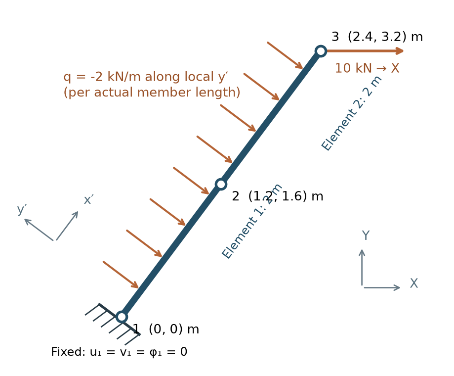

# 閱讀方式與適用範圍

本講義依據 **2D-Frame-Project 現有數學核心與求解器**整理，目標是能夠在面試中說明「為何這樣建模、公式從哪裡來、如何判斷結果可信」。以下問題是根據核心概念設計的練習題，並非特定學校或導師的已知面試題。

模型範圍是：二維、直線等截面、線彈性、小位移與小轉角、靜力 Euler–Bernoulli 剛架。每個節點有水平位移、垂直位移、轉角三個自由度。剪切變形、塑性、幾何非線性、屈曲與動力學在本講義中屬於**延伸追問**，不能當作現有求解器已具備的能力。

全文採用以下主線：

**物理假設 → 位移與應變 → 本構與能量 → 形函數與剛度 → 座標轉換與組裝 → 荷載與約束 → 求解 → 反力與內力 → 驗證。**

- 第一部分：24 題問答，每題含可口述的回答與追問。
- 第二部分：一題兩單元傾斜懸臂，從形函數到結果完整推導。
- 第三部分：同一題的解析解、誤差、能量檢查與變形題。
- 最後附：面試練習方式、現有程式對照與核對記錄。

建議第一次先完成 Q1–Q16 與例題第 1–11 步，再讀驗證與研究延伸。公式中的正負號均沿用本專案，而不是混用其他教材的彎矩符號。

# 第一部分：24 題可能出現的面試問題

## A. 物理建模：你究竟在求什麼？

### Q1．請用一分鐘解釋你的有限元素求解器。

**回答要點：**我把結構離散成二節點梁柱單元，以節點位移與轉角作為未知數。單元內用形函數表示位移，再由位移求應變，透過線彈性本構建立內力與應變能，得到單元剛度。經過座標轉換、組裝及施加邊界條件後，求解節點位移，最後恢復反力與截面內力，並用平衡與解析解驗證。

**追問：為什麼先求位移？**這是位移型有限元素法。共享節點自由度直接保證離散相容性，平衡則透過弱形式成立。不是所有有限元素法都必須以位移為唯一未知數。

### Q2．桿、梁與剛架單元有何差別？

**回答要點：**桿單元描述軸向伸縮；平面梁單元描述橫向位移與彎曲轉角；平面剛架單元同時描述軸向與彎曲，因此每節點有 $[u,v,\phi]$ 三個自由度。剛接節點共用同一轉角，能傳遞彎矩。

**追問：把轉角設為零就能模擬鉸嗎？**不能。零轉角是轉動約束；鉸允許轉動，端彎矩通常為零。構件內鉸或端部釋放需要釋放相應端彎矩或調整自由度，不能把「支座鉸」與「構件彎矩釋放」視為同一件事。

### Q3．Euler–Bernoulli 梁的核心假設是什麼？

**回答要點：**截面變形後仍保持平面且垂直於變形後的中性軸，因此忽略橫向剪切變形；小轉角下 $\phi=dv/dx$。適用性要看剪切變形相對於彎曲變形是否可忽略，不能只看材料是否線彈性。

**追問：短深梁如何處理？**考慮 Timoshenko 梁，讓截面轉角成為獨立場，納入 $\gamma=dv/dx-\phi$ 與剪切剛度。具體的正負號應與選定的旋轉約定一致。

### Q4．線彈性與幾何線性是不是同一件事？

**回答要點：**不是。線彈性描述應力與應變的關係；幾何線性描述應變近似以及是否在未變形幾何上建立平衡。材料可保持線彈性，但結構因大轉角或二階效應出現非線性。

**追問：荷載加倍，位移一定加倍嗎？**只有在固定剛度、固定邊界條件的線性問題中成立；若存在非零指定支座位移，應將「由荷載引起的位移增量」與指定變位造成的響應分開。

## B. 運動學、弱形式與插值：公式從哪裡來？

### Q5．節點位移如何變成應力？

**回答要點：**先插值得到 $u(x),v(x)$，再微分求軸向應變 $\varepsilon_0=du/dx$ 與曲率 $\kappa=d^2v/dx^2$。取截面形心軸，距中性軸 $y$ 的纖維應變為

$$\varepsilon_x(x,y)=\varepsilon_0(x)-y\kappa(x),\qquad \sigma_x=E\varepsilon_x.$$

由截面積分可得 $N=EA\varepsilon_0$，本專案的彎矩定義為 $M=EI\kappa$，對應 $\sigma_x=N/A-My/I$。

**追問：為何局部軸向與彎曲不耦合？**本模型使用形心參考軸、均質截面與線性運動學，$\int_A y\,dA=0$，使能量中的軸彎交叉項消失；偏心參考軸或更一般截面模型可能出現耦合。

### Q6．為何需要弱形式，不能直接解微分方程嗎？

**回答要點：**直接解強形式需要在每點滿足微分平衡。弱形式要求對任意容許虛位移滿足虛功平衡，經分部積分降低位移場的導數要求，也把端力與端彎矩自然帶入邊界項。它讓分段近似函數能用於求解。

$$\int_0^L EA\,u_{,x}\delta u_{,x}\,dx+
\int_0^L EI\,v_{,xx}\delta v_{,xx}\,dx
=\delta W_{\mathrm{ext}}.$$

**追問：弱形式是否代表平衡不重要？**平衡仍然是核心，只是先在所選測試空間內成立；有限網格的近似解不一定逐點滿足強形式。

### Q7．為何軸向用一次插值、彎曲用三次 Hermite 插值？

**回答要點：**軸向兩個端點位移可決定一次多項式。彎曲兩端各有位移與轉角，共四個端點條件，三次多項式能全部滿足。標準位移型 Euler–Bernoulli 弱形式含二階導數，要求相容插值具備足夠連續性；Hermite 插值在相鄰共線單元間可保持位移與斜率連續。

**追問：一定只能用三次 Hermite 嗎？**不是，它是本專案的標準二節點相容選擇。混合形式、非相容或不連續方法及其他光滑基底有不同構造，不能把此要求不加條件地套到所有梁有限元素方法。

### Q8．剛度矩陣為何是 $\int B^TDB\,dx$？

**回答要點：**將離散應變 $\varepsilon=Bd$ 代入應變能 $U=\frac12\int\varepsilon^TD\varepsilon\,dx$，可寫成 $U=\frac12d^Tkd$。比較兩式得到 $k=\int B^TDB\,dx$。再對自由度求導得到內力 $f_{\mathrm{int}}=kd$。

**追問：剛度矩陣中的某一項代表什麼？**$k_{ij}$ 是第 $j$ 個自由度產生單位廣義位移、其餘自由度為零時，第 $i$ 個廣義力的響應係數。位移和轉角的單位不同，矩陣各區塊的量綱也不同。

## C. 矩陣與座標：你理解線性代數嗎？

### Q9．單元剛度矩陣為何對稱？

**回答要點：**對本模型，$D$ 對稱，故 $(B^TDB)^T=B^TDB$。也可由應變能對自由度的二階導數理解；這對應線性保守彈性系統的互等性。

**追問：所有力學問題的切線矩陣都對稱嗎？**不能一概而論。非保守外力、非關聯材料模型或某些離散形式可能產生非對稱切線。

### Q10．單元矩陣是正定的嗎？為何會奇異？

**回答要點：**未加約束的二維梁柱單元有兩個剛體平移與一個剛體轉動，這些運動不產生應變能。因此單元矩陣是半正定而不是正定。對有效的正 $E,A,I,L$，它有三個剛體零模態。

**追問：組裝後何時能唯一求解？**在去除所有剛體運動與機構、連接與材料參數有效的穩定線彈性模型中，約束後的 $K_{ff}$ 才可正定。奇異時先查連接、支承與釋放，不應直接加很小的對角數掩蓋模型問題。

### Q11．為何位移用 $T$，力卻用 $T^T$？

**回答要點：**定義 $d'=Td$。由虛功不變，$\delta d^Tf=\delta d'^Tf'=\delta d^TT^Tf'$，故 $f=T^Tf'$。因此 $k=T^Tk'T$。

**追問：剛度轉換能不能只轉左邊？**不能。力的分量與位移的分量都改變，需同時轉換；只乘一側通常不再維持原本的能量關係。

### Q12．組裝剛度矩陣究竟在做什麼？

**回答要點：**相鄰單元共用同一節點的位移與轉角，因此位移相容；該節點的各單元端力相加，形成節點平衡。若 $A_e$ 為自由度抽取矩陣，$d_e=A_ed$，則

$$K=\sum_e A_e^TT_e^Tk'_eT_eA_e.$$

**追問：為什麼共享節點的剛度要相加？**共享節點的同一虛位移會同時使相連單元做功，因此總能量與對該自由度的力響應都是各單元貢獻之和。

## D. 荷載與邊界條件：最容易算錯的地方

### Q13．為何均布荷載不能只平均分配為兩個端力？

**回答要點：**一致節點荷載要求對所採形函數表示的任意虛位移保持功相等，不只要求合力相等。梁的轉角也是自由度，因此均布荷載通常還需要一對端部等效力矩。

$$p^{0\prime}=\int_0^L N_f^Tq\,dx.$$

**追問：兩端等效力矩合計為零，為何不能刪除？**端點虛轉角通常不同，兩個力矩的虛功未必抵消。刪除後改變荷載對離散位移場的作用。

### Q14．支座沉陷與斜向滾支承如何施加？

**回答要點：**已知位移 $d_c$ 可為非零，自由方程為

$$K_{ff}d_f=\bar P_f-K_{fc}d_c.$$

斜向滾支承限制的是支承法向位移，應先旋轉到支座座標，或施加 $n_xu+n_yv=\bar d_n$；不是任意把全局 $u$ 或 $v$ 設為零。

**追問：支座沉陷但沒有外力，會有內力嗎？**可能有，取決於約束與相容性；指定變位若迫使結構產生應變，即使直接外力為零仍會產生內力。

### Q15．為何求解時不直接計算 $K^{-1}$？

**回答要點：**實際上需要的是解線性方程組。利用合適的矩陣分解通常更節省運算與儲存，也更利於維持數值精度；顯式建立逆矩陣沒有必要。對稱正定系統可考慮 Cholesky，大型問題還需利用稀疏結構。

**追問：殘差很小是否代表位移誤差很小？**不一定，病態矩陣可放大輸入與捨入誤差；還要考慮條件數、自由度尺度、物理模型與離散誤差。

### Q16．為何反力與單元端力都要扣除荷載？

**回答要點：**完整平衡為 $Kd=\bar P+R$，因此 $R=Kd-\bar P$。單元端力是 $q'=k'd'-p^{0\prime}$，因為 $k'd'$ 已包含單元構件荷載的等效作用。若不扣除，連自由端也可能出現不合理的端彎矩。

**追問：固定端力與一致節點荷載有何關係？**若單元所有節點自由度均固定，$d'=0$，所以固定端力為 $-p^{0\prime}$。兩者是相反符號，使用位置也不同。

## E. 結果與驗證：你如何證明算得可信？

### Q17．端彎矩就是截面彎矩嗎？

**回答要點：**必須先指定正號。本專案使用

$$m_i=-M(0),\quad m_j=M(L),\quad f_{yi}=V(0),\quad f_{yj}=-V(L).$$

左端節點端力的正方向和截面內力的正方向不是完全相同，因此固定端反力矩為正時，固定端截面彎矩可為負。

**追問：為何兩本教材的剪力圖正負相反？**先檢查截面切面、力的正方向及關係式；只要平衡、應力與邊界映射一致，不同符號約定可描述同一物理狀態。

### Q18．為何有均布荷載時，不能只用 $EI v_h''$ 畫彎矩圖？

**回答要點：**三次有限元素位移的二階導數只有一次，而常數均布荷載下的精確彎矩是二次。位移微分得到的是離散本構彎矩；由端力與實際荷載積分得到的是平衡恢復彎矩，兩者在有限網格上不必相同。

**追問：哪一個一定是精確解？**一般都不能預先宣稱精確。本講義的等剛度、靜定懸臂特例中，正確端力與實際荷載可恢復精確的平衡內力；不應推廣到任意複雜剛架。

### Q19．你會用哪些互相獨立的檢查？

**回答要點：**檢查單位與荷載方向、剛度對稱性和剛體模態、自由方向殘差、整體力與力矩平衡、單元端力平衡，再與獨立解析解和網格加密結果比較。

**追問：能否把力與力矩直接放在同一個殘差範數？**它們量綱不同。應分別給出力與力矩容許誤差，或先用特徵長度 $L_0$ 將力矩除以 $L_0$，並用特徵力無量綱化。未縮放的混合範數會依單位制改變。

### Q20．節點位移與解析解相同，是否代表已經沒有離散誤差？

**回答要點：**不是。某些一維常剛度問題具有節點精確性，但單元內部的插值場仍可能不精確。應另外比較內部位移、曲率及能量誤差。

**追問：你的例題怎樣展示這件事？**兩單元解的節點位移與解析解吻合，但每個單元中點仍有約 $0.010417\ \mathrm{mm}$ 的橫向位移誤差；單元長度減半後，這個特例的中點誤差縮小到約 $1/16$。

## F. 研究延伸：從完成工具走向博士研究

### Q21．如何把線性求解改成幾何非線性求解？

**回答要點：**要重新定義非線性運動學、內力與平衡，而不是只更新幾個剛度係數。若定義殘差 $r=f_{\mathrm{ext}}-f_{\mathrm{int}}$，Newton 修正滿足

$$K_T\Delta d=r,\qquad d^{(k+1)}=d^{(k)}+\Delta d.$$

外力與位移無關時 $K_T=\partial f_{\mathrm{int}}/\partial d$；若外力隨變形改變，還需包含其導數。每步都要檢查迭代收斂。

**追問：一致切線為何重要？**它應是離散殘差的正確線性化，才能在適當條件下獲得 Newton 法的局部快速收斂。此為研究延伸，現有核心仍是線性靜力。

### Q22．線性靜力求解器能直接給出屈曲荷載嗎？

**回答要點：**不能。線性靜力剛度沒有描述受力後的幾何剛度。線性特徵屈曲分析需要預應力狀態與相應幾何剛度，例如在特定符號約定下求 $(K_E+\lambda K_G)\psi=0$。

**追問：特徵屈曲荷載就是實際承載力嗎？**不是。它是理想化模型下的分岔預測，不能直接取代缺陷、材料非線性、極限點與後屈曲路徑分析。

### Q23．Timoshenko 梁為何可能出現剪切鎖定？

**回答要點：**薄梁極限要求剪切應變接近零。若離散的位移與轉角空間無法恰當滿足這個約束，就會產生過大的虛假剪切能，使結構過硬。可研究合適插值、混合形式或選擇性積分等方法。

**追問：減少積分點就一定正確嗎？**不是。降低積分也可能引入非物理零能模態；需同時驗證秩、能量、基準解與收斂。本專案的 Euler–Bernoulli 單元本身沒有剪切能項。

### Q24．如果導師問「這個專案的研究價值是什麼」，你如何回答？

**回答要點：**可先誠實區分經典方法實作與研究創新。這個專案展示我能把建模假設、變分推導、離散、求解與驗證串起來；研究工作則需要提出可檢驗的新問題，例如某種非線性模型在薄壁結構穩定性分析中的精度、魯棒性或計算成本。

**追問：你會怎樣設計下一個研究比較？**先固定問題與基準，控制網格、容許誤差及計算成本，比較候選方法的精度、收斂與失效條件，避免只展示一張「看起來合理」的變形圖。

# 第二部分：一個可反覆改題的綜合例題

## 題目：兩單元傾斜懸臂，同時承受節點力與均布荷載

一根直線、等截面的二維梁柱，分成兩個等長的剛接單元。全局 $X$ 向右、$Y$ 向上，轉角與力矩逆時針為正。

| 節點 | $X$（m） | $Y$（m） | 條件 |
|---|---:|---:|---|
| 1 | 0 | 0 | 完全固定：$u_1=v_1=\phi_1=0$ |
| 2 | 1.2 | 1.6 | 兩單元共用的剛接節點 |
| 3 | 2.4 | 3.2 | 自由端，施加 $F_X=10\ \mathrm{kN}$，$F_Y=0$ |

單元 1 為 $1\to2$，單元 2 為 $2\to3$。材料及截面資料：

$$E=200\ \mathrm{GPa},\qquad A=5.0\times10^{-3}\ \mathrm{m^2},\qquad I=4.0\times10^{-5}\ \mathrm{m^4}.$$

兩個單元均承受**沿局部負 $y'$ 方向**的均布荷載 $w=2\ \mathrm{kN/m}$，荷載強度以構件實際長度計。它不是全局鉛直荷載。忽略自重的其他貢獻。

**要求：**

1. 建立局部軸、自由度、形函數與單元剛度。
2. 求一致節點荷載，展示座標轉換與兩單元組裝。
3. 求三個節點的位移、固定端反力與兩單元端力。
4. 求全梁的 $N(x),V(x),M(x)$。
5. 用解析解、整體平衡、能量與網格加密檢查結果。
6. 解釋本題哪些量精確、哪些仍有離散誤差。

本題能練到剛架核心中的軸向與彎曲、旋轉與組裝、分布荷載及恢復。它不包含非共線梁柱接頭的多方向耦合、超靜定內力重分配或非線性；「泛用」指推導流程可以移植，不表示一題涵蓋所有結構情況。

## 第 1 步：幾何、剛度尺度與荷載方向

每個單元的長度為

$$h=\sqrt{1.2^2+1.6^2}=2\ \mathrm m,\qquad L=2h=4\ \mathrm m.$$

方向餘弦：

$$c=\frac{1.2}{2}=0.6,\qquad s=\frac{1.6}{2}=0.8.$$

所以局部單位向量為 $e_{x'}=(0.6,0.8)$、$e_{y'}=(-0.8,0.6)$。下文 $x$ 表示沿全梁由固定端量起的**局部軸向座標**；單元內座標另記為 $t\in[0,h]$。

改用 kN、m 作為手算單位：

$$E=2.0\times10^8\ \mathrm{kN/m^2},\qquad EA=10^6\ \mathrm{kN},\qquad EI=8000\ \mathrm{kN\,m^2}.$$

全局端力轉為局部：

$$\begin{bmatrix}F_{x'}\\F_{y'}\end{bmatrix}
=\begin{bmatrix}0.6&0.8\\-0.8&0.6\end{bmatrix}
\begin{bmatrix}10\\0\end{bmatrix}
=\begin{bmatrix}6\\-8\end{bmatrix}\ \mathrm{kN}.$$

因此本題有 $6\ \mathrm{kN}$ 軸向拉力、$8\ \mathrm{kN}$ 向局部負橫向的端力。均布荷載為 $q_y=-2\ \mathrm{kN/m}$，轉回全局是

$$\begin{bmatrix}q_X\\q_Y\end{bmatrix}
=\begin{bmatrix}0.6&-0.8\\0.8&0.6\end{bmatrix}
\begin{bmatrix}0\\-2\end{bmatrix}
=\begin{bmatrix}1.6\\-1.2\end{bmatrix}\ \mathrm{kN/m}.$$

**物理意義：**一個全局水平力，對傾斜構件同時產生軸向拉伸與彎曲。荷載的座標定義必須先於剛度計算釐清。

## 第 2 步：從運動學得到應變能與弱形式

在本節的局部座標中省略撇號。Euler–Bernoulli 運動學為

$$u_x(t,y)=u(t)-y\frac{dv}{dt},\qquad
\varepsilon_x=\frac{du}{dt}-y\frac{d^2v}{dt^2}.$$

使用 $\int_A y\,dA=0$ 與 $I=\int_A y^2\,dA$，截面積分後得到

$$U_e=\frac12\int_0^h\left[EA\left(\frac{du}{dt}\right)^2+
EI\left(\frac{d^2v}{dt^2}\right)^2\right]dt.$$

令 $\varepsilon_0=u_{,t}$、$\kappa=v_{,tt}$，則 $N=EA\varepsilon_0$、$M=EI\kappa$。

對能量取變分，內虛功為

$$\delta U_e=\int_0^h\left(N\delta u_{,t}+M\delta v_{,tt}\right)dt.$$

軸向分部積分一次，彎曲分部積分兩次：

$$\int_0^hN\delta u_{,t}dt=[N\delta u]_0^h-\int_0^hN_{,t}\delta u\,dt,$$

$$\int_0^hM\delta v_{,tt}dt=[M\delta\phi]_0^h-[M_{,t}\delta v]_0^h+
\int_0^hM_{,tt}\delta v\,dt.$$

將外虛功寫成分布荷載功加端力功，比較域內係數得到

$$N_{,t}+q_x=0,\qquad M_{,tt}=q_y.$$

定義 $V=M_{,t}$，便有 $V_{,t}=q_y$。比較邊界項得到

$$f_{xi}=-N(0),\ f_{xj}=N(h),\quad
f_{yi}=V(0),\ f_{yj}=-V(h),\quad
m_i=-M(0),\ m_j=M(h).$$

**物理意義：**剛度、分布荷載與端力符號來自同一套虛功式，不需要各自背一套可能矛盾的符號。

## 第 3 步：把端點自由度變成連續位移

局部自由度順序固定為

$$d'_e=[u'_i,v'_i,\phi'_i,u'_j,v'_j,\phi'_j]^T.$$

### 3.1 軸向插值

假設 $u(t)=a_0+a_1t$。由 $u(0)=u'_i$、$u(h)=u'_j$ 得

$$u(t)=\left(1-\frac th\right)u'_i+\frac th u'_j,
\qquad \varepsilon_0=\begin{bmatrix}-1/h&1/h\end{bmatrix}
\begin{bmatrix}u'_i\\u'_j\end{bmatrix}.$$

所以

$$k'_a=\int_0^hEA B_a^TB_a\,dt
=\frac{EA}{h}\begin{bmatrix}1&-1\\-1&1\end{bmatrix}.$$

### 3.2 彎曲插值

假設 $v(t)=a_0+a_1t+a_2t^2+a_3t^3$。先由左端條件得到 $a_0=v'_i$、$a_1=\phi'_i$；右端兩條件為

$$a_2h^2+a_3h^3=v'_j-v'_i-h\phi'_i,$$

$$2a_2h+3a_3h^2=\phi'_j-\phi'_i.$$

將第二式乘以 $h$ 再減去第一式的兩倍：

$$a_3h^3=h(\phi'_i+\phi'_j)-2(v'_j-v'_i).$$

回代得到

$$a_2=\frac{3(v'_j-v'_i)}{h^2}-\frac{2\phi'_i+\phi'_j}{h},\qquad
 a_3=-\frac{2(v'_j-v'_i)}{h^3}+\frac{\phi'_i+\phi'_j}{h^2}.$$

令 $\xi=t/h$，按端點自由度收集係數：

$$v(t)=H_1v'_i+H_2\phi'_i+H_3v'_j+H_4\phi'_j,$$

$$H_1=1-3\xi^2+2\xi^3,\qquad H_2=h(\xi-2\xi^2+\xi^3),$$

$$H_3=3\xi^2-2\xi^3,\qquad H_4=h(-\xi^2+\xi^3).$$

微分兩次：

$$B_b=\begin{bmatrix}
(-6+12\xi)/h^2&(-4+6\xi)/h&(6-12\xi)/h^2&(-2+6\xi)/h
\end{bmatrix}.$$

**量綱檢查：**$H_1,H_3$ 無量綱；$H_2,H_4$ 帶長度，乘上無量綱的轉角後才能形成位移。

## 第 4 步：積分求局部剛度

代入彎曲能量，$k'_b=\int_0^h B_b^TEIB_b\,dt$。展示兩個代表性項，並用 $dt=h\,d\xi$：

$$k_{b,11}=\frac{EI}{h^3}\int_0^1(-6+12\xi)^2d\xi
=\frac{EI}{h^3}(36-72+48)=\frac{12EI}{h^3},$$

$$k_{b,12}=\frac{EI}{h^2}\int_0^1(-6+12\xi)(-4+6\xi)d\xi
=\frac{EI}{h^2}(24-42+24)=\frac{6EI}{h^2}.$$

其餘項用相同積分方式，得到

$$k'_b=\frac{EI}{h^3}
\begin{bmatrix}
12&6h&-12&6h\\
6h&4h^2&-6h&2h^2\\
-12&-6h&12&-6h\\
6h&2h^2&-6h&4h^2
\end{bmatrix}.$$

本題係數為

$$\frac{EA}{h}=500000,\quad\frac{12EI}{h^3}=12000,\quad
\frac{6EI}{h^2}=12000,\quad\frac{4EI}{h}=16000,\quad\frac{2EI}{h}=8000.$$

依六自由度順序嵌入軸向與彎曲矩陣：

$$k'_e=
\begin{bmatrix}
500000&0&0&-500000&0&0\\
0&12000&12000&0&-12000&12000\\
0&12000&16000&0&-12000&8000\\
-500000&0&0&500000&0&0\\
0&-12000&-12000&0&12000&-12000\\
0&12000&8000&0&-12000&16000
\end{bmatrix}.$$

此矩陣與以 m、rad 表示的位移相乘，輸出交錯排列的 kN、kN·m；不能把整個矩陣標成單一量綱。

## 第 5 步：由虛功求一致節點荷載

每個單元有 $q_y=-2\ \mathrm{kN/m}$。對任意節點虛位移，

$$\delta W_q=\int_0^h\delta v\,q_y\,dt
=\delta d_b^T\int_0^hH^Tq_y\,dt.$$

四個形函數的積分分別是

$$\int_0^hH_1dt=h[\xi-\xi^3+\tfrac12\xi^4]_0^1=h/2,$$

$$\int_0^hH_2dt=h^2[\tfrac12\xi^2-\tfrac23\xi^3+\tfrac14\xi^4]_0^1=h^2/12,$$

$$\int_0^hH_3dt=h[\xi^3-\tfrac12\xi^4]_0^1=h/2,$$

$$\int_0^hH_4dt=h^2[-\tfrac13\xi^3+\tfrac14\xi^4]_0^1=-h^2/12.$$

因此每個單元的荷載向量為

$$p_e^{0\prime}=
\begin{bmatrix}0\\q_yh/2\\q_yh^2/12\\0\\q_yh/2\\-q_yh^2/12\end{bmatrix}
=\begin{bmatrix}0\\-2\\-2/3\\0\\-2\\2/3\end{bmatrix}.$$

**檢查：**合橫向力為 $-4\ \mathrm{kN}$；對左端取矩為 $(-2)(2)-2/3+2/3=-4\ \mathrm{kN\,m}$，等於原均布荷載合力作用在中點的力矩。虛功推導還確保了比合力、合矩更強的一致性。

## 第 6 步：座標轉換與兩單元組裝

單節點旋轉矩陣及單元轉換矩陣為

$$R=\begin{bmatrix}0.6&0.8&0\\-0.8&0.6&0\\0&0&1\end{bmatrix},\qquad
T=\begin{bmatrix}R&0\\0&R\end{bmatrix}.$$

它們滿足 $d'_e=Td_e$、$T^TT=I$。由能量或虛功不變得到

$$k_e=T^Tk'_eT,\qquad p_e^0=T^Tp_e^{0\prime}.$$

例如全局單元剛度的一個分量為

$$k_{u_i u_i}=0.6^2(500000)+(-0.8)^2(12000)=187680\ \mathrm{kN/m}.$$

均布荷載轉為全局節點向量：

$$p_e^0=[1.6,-1.2,-2/3,\ 1.6,-1.2,2/3]^T.$$

### 6.1 為何本題可在共同局部座標求解？

兩單元共線、方向完全相同，可以讓三個節點共用一套旋轉後的座標。令 $\mathcal R=\operatorname{diag}(R,R,R)$，則

$$\widehat d=\mathcal R d,\quad
\widehat K=\mathcal R K\mathcal R^T,\quad
\widehat P=\mathcal R\bar P.$$

這是一個正交基底變換。先在此座標求解再轉回全局，與先轉換各單元後組裝全局矩陣等價。**非共線剛架不能讓每個單元各用自己的局部座標就直接相加。**

### 6.2 展示共享節點的組裝

共同座標自由度順序為

$$\widehat d=[u'_1,v'_1,\phi_1,u'_2,v'_2,\phi_2,u'_3,v'_3,\phi_3]^T.$$

單元 1 對應位置 $(1,2,3,4,5,6)$；單元 2 對應 $(4,5,6,7,8,9)$。把單元剛度寫成兩節點的 $3\times3$ 區塊：

$$k'_e=\begin{bmatrix}k_{ii}&k_{ij}\\k_{ji}&k_{jj}\end{bmatrix}.$$

全結構組裝後為

$$\widehat K=\begin{bmatrix}
k_{ii}&k_{ij}&0\\
k_{ji}&k_{jj}+k_{ii}&k_{ij}\\
0&k_{ji}&k_{jj}
\end{bmatrix}.$$

例如節點 2 的 $v'_2$ 對角項是 $12000+12000=24000$；其 $v'_2$ 與 $\phi_2$ 的耦合項是 $-12000+12000=0$。後者是本題等長、等剛度且共線的結果，不能對任意節點預設為零。

### 6.3 荷載也在共享節點相加

| 節點 | 均布荷載的軸向力（kN） | 橫向力（kN） | 力矩（kN·m） |
|---|---:|---:|---:|
| 1 | 0 | −2 | −2/3 |
| 2 | 0 | −4 | $2/3-2/3=0$ |
| 3 | 0 | −2 | +2/3 |

再加上節點 3 的直接荷載 $(6,-8,0)$，得到

$$\widehat P=[0,-2,-2/3,\ 0,-4,0,\ 6,-10,2/3]^T.$$

固定節點 1 的荷載也必須保留，因為最後計算反力要使用。

## 第 7 步：施加邊界條件，手算節點位移

節點 1 完全固定。分塊的**完整**平衡方程應包括反力：

$$\begin{bmatrix}K_{ff}&K_{fc}\\K_{cf}&K_{cc}\end{bmatrix}
\begin{bmatrix}d_f\\d_c\end{bmatrix}
=\begin{bmatrix}\bar P_f\\\bar P_c+R_c\end{bmatrix}.$$

本題 $d_c=0$，只需解 $K_{ff}d_f=\bar P_f$。軸向與彎曲在共同座標中可分開手算。

### 7.1 軸向的兩條方程

$$\begin{bmatrix}1000000&-500000\\-500000&500000\end{bmatrix}
\begin{bmatrix}u'_2\\u'_3\end{bmatrix}
=\begin{bmatrix}0\\6\end{bmatrix}.$$

第一條給出 $u'_3=2u'_2$；代入第二條：

$$500000(2u'_2-u'_2)=6,$$

$$u'_2=0.000012\ \mathrm m=0.012\ \mathrm{mm},\qquad
u'_3=0.000024\ \mathrm m=0.024\ \mathrm{mm}.$$

### 7.2 彎曲的四條方程

按 $[v'_2,\phi_2,v'_3,\phi_3]$ 排列，得到

$$\begin{bmatrix}
24000&0&-12000&12000\\
0&32000&-12000&8000\\
-12000&-12000&12000&-12000\\
12000&8000&-12000&16000
\end{bmatrix}
\begin{bmatrix}v'_2\\\phi_2\\v'_3\\\phi_3\end{bmatrix}
=\begin{bmatrix}-4\\0\\-10\\2/3\end{bmatrix}.$$

為使消元好讀，定義 $a,b,c_*,d$ 分別為 $v'_2$ 的 mm 數值、$\phi_2$ 的 mrad 數值、$v'_3$ 的 mm 數值、$\phi_3$ 的 mrad 數值。四個未知量的 SI 數值都等於此處數值的 $10^{-3}$ 倍，因此方程變為

$$24a-12c_*+12d=-4,\qquad(1)$$

$$32b-12c_*+8d=0,\qquad(2)$$

$$-12a-12b+12c_*-12d=-10,\qquad(3)$$

$$12a+8b-12c_*+16d=2/3.\qquad(4)$$

由 (3)：$c_*=a+b+d-5/6$。代入 (1)：

$$24a-12(a+b+d-5/6)+12d=-4,$$

$$12a-12b+10=-4\quad\Rightarrow\quad a=b-7/6.$$

代入 (2)：

$$32b-12(a+b+d-5/6)+8d=0,$$

$$-12a+20b-4d+10=0.$$

再代入 $a=b-7/6$，得到 $8b-4d+24=0$，即 $d=2b+6$。

把 $c_*=a+b+d-5/6$ 代入 (4)：

$$12a+8b-12(a+b+d-5/6)+16d=2/3,$$

$$-4b+4d+10=2/3\quad\Rightarrow\quad d-b=-7/3.$$

聯立 $d=2b+6$ 得

$$b=-25/3,\qquad d=-32/3,\qquad a=-19/2,\qquad c_*=-88/3.$$

因此局部節點結果為

| 節點 | $u'$（mm） | $v'$（mm） | $\phi$（mrad） |
|---|---:|---:|---:|
| 1 | 0 | 0 | 0 |
| 2 | +0.012000 | −9.500000 | −8.333333 |
| 3 | +0.024000 | −29.333333 | −10.666667 |

### 7.3 轉回全局

$$u=0.6u'-0.8v',\qquad v=0.8u'+0.6v',\qquad\phi=\phi'.$$

例如節點 3：

$$u_3=0.6(0.024)-0.8(-29.333333)=23.481067\ \mathrm{mm},$$

$$v_3=0.8(0.024)+0.6(-29.333333)=-17.580800\ \mathrm{mm}.$$

| 節點 | 全局 $u$（mm） | 全局 $v$（mm） | $\phi$（mrad） |
|---|---:|---:|---:|
| 1 | 0 | 0 | 0 |
| 2 | +7.607200 | −5.690400 | −8.333333 |
| 3 | +23.481067 | −17.580800 | −10.666667 |

**物理判斷：**自由端向右、向下並順時針旋轉，符合荷載方向。最大轉角約 $0.0107\ \mathrm{rad}$，橫向端位移約佔梁長 $0.73\%$，與本題的小變形教學假設相容；這不代表已完成特定實體構件的設計或承載力判定。

## 第 8 步：恢復兩個單元端力

使用 $q'_e=k'_ed'_e-p_e^{0\prime}$。局部位移以 m、rad 代入：

$$d'_1=[0,0,0,\ 0.000012,-0.0095,-0.008333333]^T,$$

$$d'_2=[0.000012,-0.0095,-0.008333333,\ 0.000024,-0.029333333,-0.010666667]^T.$$

計算時使用前一步的精確分數值，避免展示用小數造成累積捨入。單元 1 的前幾個乘積為

$$ (k'_1d'_1)_1=-500000(0.000012)=-6,$$

$$(k'_1d'_1)_2=-12000(-0.0095)+12000(-0.008333333)=14,$$

$$(k'_1d'_1)_3=-12000(-0.0095)+8000(-0.008333333)=47\tfrac13.$$

完整乘積與扣除結果：

$$k'_1d'_1=[-6,14,47\tfrac13,\ 6,-10,-19\tfrac13]^T,$$

$$q'_1=[-6,16,48,\ 6,-12,-20]^T.$$

單元 2 的左端橫向力乘積，例如為

$$12000(-0.0095)+12000(-0.008333333)
-12000(-0.029333333)+12000(-0.010666667)=10.$$

完整結果為

$$k'_2d'_2=[-6,10,19\tfrac13,\ 6,-6,2/3]^T,$$

$$q'_2=[-6,12,20,\ 6,-8,0]^T.$$

以上向量的第 1、2、4、5 項為 kN，第 3、6 項為 kN·m。

**兩項檢查：**節點 2 的相鄰單元端力相加，$(6,-12,-20)+(-6,12,20)=(0,0,0)$，符合該處沒有直接節點荷載；自由端端力為 $(6,-8,0)$，恰好等於直接端荷載。若省略扣除 $p^{0\prime}$，自由端會錯誤地留下 $2/3\ \mathrm{kN\,m}$。

## 第 9 步：計算固定端反力

由 $R=Kd-\bar P$，或本題單元 1 左端端力，取得局部支承反力：

$$R'_{x,1}=-6\ \mathrm{kN},\qquad R'_{y,1}=16\ \mathrm{kN},\qquad M_1=48\ \mathrm{kN\,m}.$$

轉回全局：

$$R_{X,1}=0.6(-6)-0.8(16)=-16.4\ \mathrm{kN},$$

$$R_{Y,1}=0.8(-6)+0.6(16)=4.8\ \mathrm{kN},\qquad M_1=48\ \mathrm{kN\,m}.$$

**整體平衡逐項核對：**均布荷載全局合力為 $(6.4,-4.8)\ \mathrm{kN}$，作用點為全梁中點 $(1.2,1.6)\ \mathrm m$。

$$\sum F_X=-16.4+10+6.4=0,$$

$$\sum F_Y=4.8-4.8=0,$$

$$\sum M_1=48+(2.4\times0-3.2\times10)
+[1.2(-4.8)-1.6(6.4)]$$

$$=48-32-16=0\ \mathrm{kN\,m}.$$

這項檢查直接使用原始物理荷載與座標，沒有重複使用已組裝矩陣作為唯一依據。

## 第 10 步：由平衡恢復全梁截面內力

現在 $x\in[0,4]$ 是從固定端起算的局部座標，並以 m 的數值代入以下多項式。

無軸向分布荷載，$N_{,x}=0$；由左端 $f_{x1}=-N(0)=-6$ 得

$$N(x)=6\ \mathrm{kN}.$$

由 $V_{,x}=q_y=-2$ 與 $V(0)=16$ 得

$$V(x)=16-2x\quad[\mathrm{kN}].$$

由 $M_{,x}=V$ 與 $M(0)=-m_1=-48$ 得

$$M(x)=-48+\int_0^x(16-2\eta)d\eta
=-48+16x-x^2\quad[\mathrm{kN\,m}].$$

也可寫成

$$M(x)=-8(4-x)-\frac{2}{2}(4-x)^2.$$

這表示任意截面的彎矩，由截面右側的端力與剩餘均布荷載決定。

| $x$（m） | $N$（kN） | $V$（kN） | $M$（kN·m） |
|---:|---:|---:|---:|
| 0 | 6 | 16 | −48 |
| 1 | 6 | 14 | −33 |
| 2 | 6 | 12 | −20 |
| 3 | 6 | 10 | −9 |
| 4 | 6 | 8 | 0 |

最大彎矩絕對值為固定端的 $48\ \mathrm{kN\,m}$。注意 $V(4^-)=8\ \mathrm{kN}$ 並非零，因為自由端有集中橫向力 $-8\ \mathrm{kN}$；自由端無集中力矩，所以 $M(4)=0$。

若需纖維應力，可用 $\sigma_x=N/A-My/I$。但題目只提供 $A,I$，沒有截面外緣距離，不能憑空給出最大纖維應力。

# 第三部分：解析解、離散誤差與能量

## 第 11 步：獨立積分得到解析位移

在同一局部符號下，$EI v''=M$。本題 $EI=8000\ \mathrm{kN\,m^2}$，因此

$$v''(x)=\frac{-48+16x-x^2}{8000}.$$

第一次積分：

$$\phi(x)=v'(x)=\frac{-48x+8x^2-x^3/3}{8000}+C_1.$$

固定端 $\phi(0)=0$，故 $C_1=0$。第二次積分：

$$v(x)=\frac{-24x^2+(8/3)x^3-x^4/12}{8000}+C_2.$$

固定端 $v(0)=0$，故 $C_2=0$。軸向則由 $du/dx=N/EA$ 得

$$u(x)=\frac{6x}{10^6}.$$

代入中間節點 $x=2$：

$$\phi(2)=\frac{-96+32-8/3}{8000}=-0.008333333\ \mathrm{rad},$$

$$v(2)=\frac{-96+64/3-16/12}{8000}=-0.0095\ \mathrm m.$$

代入端點 $x=4$：

$$\phi(4)=\frac{-192+128-64/3}{8000}=-0.010666667\ \mathrm{rad},$$

$$v(4)=\frac{-384+512/3-256/12}{8000}=-0.029333333\ \mathrm m.$$

與兩單元解完全吻合至數值精度。若將端力大小記為 $P=8\ \mathrm{kN}$、均布荷載大小記為 $w=2\ \mathrm{kN/m}$，同一積分結果也可寫成可重用的公式：

$$v(x)=-\frac{Px^2(3L-x)}{6EI}-\frac{wx^2(6L^2-4Lx+x^2)}{24EI},$$

$$\phi(x)=-\frac{Px(2L-x)}{2EI}-\frac{wx(3L^2-3Lx+x^2)}{6EI},$$

$$v(L)=-\frac{PL^3}{3EI}-\frac{wL^4}{8EI},\qquad
\phi(L)=-\frac{PL^2}{2EI}-\frac{wL^3}{6EI}.$$

## 第 12 步：節點正確，為何內部位移仍不精確？

精確 $v(x)$ 含四次項，單元的 Hermite 插值 $v_h$ 卻只有三次。對本題等剛度梁，一致荷載使節點位移與轉角精確；每個單元的離散位移因此就是精確解在兩端的三次 Hermite 插值。

令單元座標為 $t\in[0,h]$，誤差 $e=v-v_h$ 在兩端的值及一階導數皆為零，因此必含因子 $t^2(t-h)^2$。又因 $v_h''''=0$、$v''''=q_y/EI$，所以

$$e(t)=\frac{q_y}{24EI}t^2(t-h)^2.$$

這個式子也能說明節點精確性的原因：在任一單元內，對三次測試函數 $z_h$，其四階導數為零，而 $e=e'=0$ 於兩端。分部積分兩次即可得 $\int EI e''z_h''dt=0$，因此精確解的 Hermite 插值滿足同一離散弱式；穩定問題的離散解唯一，兩者即相同。此論證依賴本題的常數 $EI$ 與一致積分。

在單元中點 $t=h/2$：

$$e(h/2)=\frac{q_yh^4}{384EI}
=\frac{(-2)(2^4)}{384(8000)}=-0.000010416667\ \mathrm m.$$

因此精確位移比有限元素插值多向下 $0.010416667\ \mathrm{mm}$。例如第一單元中點 $x=1$，Hermite 係數為 $(1/2,1/4,1/2,-1/4)$，故

$$v_h(1)=\frac12(0)+\frac14(0)+\frac12(-0.0095)-\frac14(-0.008333333)
=-0.002666667\ \mathrm m,$$

$$v(1)=\frac{-24+8/3-1/12}{8000}=-0.002677083\ \mathrm m.$$

兩者差值正是 $-0.010416667\ \mathrm{mm}$。

### 網格加密結果

| 單元數 | 單元長 $h$（m） | 每單元中點最大位移誤差（mm） |
|---:|---:|---:|
| 1 | 4 | 0.166666667 |
| 2 | 2 | 0.010416667 |
| 4 | 1 | 0.000651042 |
| 8 | 0.5 | 0.000040690 |

本題中點誤差正比 $h^4$。不能把這個特例直接宣稱為所有剛架、所有荷載及所有誤差範數的收斂階數。

## 第 13 步：直接微分的彎矩與平衡彎矩有何差別？

由第 3 步的三次係數公式，第一單元實際有

$$a_2=\frac{3(-0.0095)}4-\frac{-0.008333333}{2}=-\frac{71}{24000},$$

$$a_3=-\frac{2(-0.0095)}8+\frac{-0.008333333}{4}=\frac7{24000}.$$

因此第一單元的離散位移與本構彎矩為

$$v_h(x)=-\frac{71}{24000}x^2+\frac7{24000}x^3,$$

$$M_h(x)=-\frac{142}{3}+14x\quad[\mathrm{kN\,m}].$$

由平衡得到的 $M_{\mathrm{eq}}=-48+16x-x^2$ 為二次函數，兩者差值為

$$M_{\mathrm{eq}}-M_h=-\frac23+2x-x^2.$$

在 $x=1$，$M_h=-33.333333$，$M_{\mathrm{eq}}=-33$，相差 $1/3\ \mathrm{kN\,m}$。這正是 $EI e''$，不代表整體節點平衡未收斂。本專案的 $N/V/M$ 後處理使用端力加實際構件荷載的平衡恢復。

## 第 14 步：能量檢查，區分離散能量與精確能量

本題支座位移為零、荷載線性從零增加，因此離散解滿足

$$U_h=\frac12d^TKd=\frac12d^T\bar P.$$

只列非零自由節點荷載功，使用 kN、m、rad：

$$2U_h=(-4)(-0.0095)+6(0.000024)+(-10)(-0.029333333)
+\frac23(-0.010666667)$$

$$=0.324366222\ \mathrm{kN\,m},\qquad U_h=162.183111\ \mathrm J.$$

這裡 $d^T\bar P$ 是最終荷載作用在最終位移上的雙線性量；在線性漸增載入下，實際外力做功是它的一半。兩者不能混稱。

精確連續解的應變能應另外計算：

$$U=\int_0^4\left(\frac{N^2}{2EA}+\frac{M^2}{2EI}\right)dx.$$

軸向部分：

$$U_a=\frac{6^2(4)}{2(10^6)}=0.000072\ \mathrm{kN\,m}=0.072\ \mathrm J.$$

彎曲部分將 $M=-48+16x-x^2$ 平方：

$$M^2=2304-1536x+352x^2-32x^3+x^4,$$

$$\int_0^4M^2dx=
\left[2304x-768x^2+\frac{352}{3}x^3-8x^4+\frac{x^5}{5}\right]_0^4$$

$$=9216-12288+\frac{22528}{3}-2048+\frac{1024}{5}
=2594.133333.$$

所以

$$U_b=\frac{2594.133333}{16000}=0.162133333\ \mathrm{kN\,m},$$

$$U=162.205333\ \mathrm J,\qquad U-U_h=0.022222222\ \mathrm J.$$

為何兩個能量不完全相等？因為 $v_h$ 並不是精確連續位移場。本題滿足 Galerkin 正交性，因此

$$U-U_h=\frac12\sum_e\int_0^h EI(e'')^2dt.$$

由 $e=\frac{q_y}{24EI}t^2(t-h)^2$，令 $\xi=t/h$，有

$$e''=\frac{q_yh^2}{24EI}(12\xi^2-12\xi+2),\qquad
\int_0^1(12\xi^2-12\xi+2)^2d\xi=\frac45.$$

每個單元的能量差為

$$\frac12\int_0^hEI(e'')^2dt=\frac{q_y^2h^5}{1440EI}.$$

兩單元合計 $2(2^2)(2^5)/(1440\times8000)=0.000022222222\ \mathrm{kN\,m}$，即 $0.022222222\ \mathrm J$，與上述差值吻合。

**面試重點：**離散能量等式通過，驗證的是離散系統內部一致性；若用平衡恢復的精確內力計算能量，得到的是另一個場的能量。不能要求兩者在有限網格上無條件相等。

# 同一題的六個變形追問

| 修改條件 | 應如何回答或重算 |
|---|---|
| $E$ 加倍 | 本題的位移、轉角減半；因為是靜定懸臂，反力和內力不變。超靜定結構若只改部分構件剛度，可能改變內力分配。 |
| $I$ 加倍 | 局部彎曲位移與轉角減半，軸向位移不變；全局位移需重新合成軸向與橫向分量。 |
| 去掉均布荷載 | 刪除 $p^0$ 與內力積分中的分布荷載項。此等剛度懸臂在端力作用下的精確橫向位移為三次，一個標準梁單元可表示整段位移。 |
| 均布荷載改為全局鉛直 $q_Y=-2$ kN/m | 先轉換，$q_{x'}=0.8(-2)=-1.6$、$q_{y'}=0.6(-2)=-1.2$ kN/m，軸力不再為常數；不能沿用本題荷載向量。這裡仍假定強度按構件實際長度計。 |
| 節點 2 改成內鉸 | 端部轉角相容性與彎矩傳遞條件改變；先檢查是否形成機構。此懸臂若在中間完全釋放彎矩，外側段可繞鉸剛體轉動，題設荷載下沒有穩定線性靜力解。 |
| 在節點 3 加鉛直滾支承 | 增加全局 $v_3=0$ 約束，結構成為超靜定。重新分塊求解，不能把原懸臂反力表直接修補後沿用。 |

# 面試口述與自測方式

**一分鐘專案介紹：**

「我的專案是二維線彈性、小變形的 Euler–Bernoulli 剛架求解器。我從節點位移與轉角出發，以形函數建立位移場，再由應變能推導單元剛度。接著用虛功不變完成座標轉換，組裝全局系統並施加支座條件，求出位移後恢復反力及截面內力。我特別區分由位移微分得到的本構內力與由端力、荷載恢復的平衡內力，並以解析解、整體平衡與網格加密檢查結果。現有模型是線性靜力；非線性及穩定性分析需要另行建立運動學與一致切線。」

**三輪自測：**

1. 不看講義，用 60 秒說完數學主線；每說一個公式，補一句物理意義。
2. 用 20–30 分鐘重做例題的荷載轉換、約束後矩陣、消元、端力與反力；不要求背出 36 個矩陣數字。
3. 用 10 分鐘回答 Q18、Q20 與能量差異：這一輪檢查是否理解有限元素近似的限制。

# 依據與核對記錄

本講義主要依據本地數學文件及本次讀取的程式，例題為另行設計並獨立計算。下列路徑以專案根目錄為基準：

| 主題 | 本地依據 |
|---|---|
| 假設、公式與符號 | `Math Logic/2D_Frame_有限元素數學依據.md` |
| 梁柱局部剛度 | `src/frame2d/stiffness.py` |
| 位移與力的轉換 | `src/frame2d/transformation.py` |
| 自由度與組裝 | `src/frame2d/assembly.py` |
| 一致節點荷載 | `src/frame2d/loads.py` |
| 約束與求解 | `src/frame2d/solution.py`、`src/frame2d/solver.py` |
| 端力與截面內力 | `src/frame2d/recovery.py`、`src/frame2d/postprocessing.py` |

外部教學核對：標準位移型 Euler–Bernoulli 梁的弱形式、Hermite 插值與連續性可參照 [TU Delft：Euler–Bernoulli beam elements](https://interactivetextbooks.citg.tudelft.nl/computational-modelling/structural_linear/euler_bernouilli.html)。該教材的彎矩符號與本專案可能不同；本講義的端力映射與算例全部使用前述本地約定。

**本次驗證（2026-09-10）：**以現有求解器分別求解 1、2、4、8 單元模型；逐一核對所有節點位移與解析解、支座反力、取樣截面內力和單元平衡。另以獨立約束後矩陣確認手算消元結果，並用解析多項式積分核對能量差。全部核對通過。這些結果只證明本講義算例的相應數值與公式一致，不代表對所有問題或整個軟體功能完成全面驗證。
